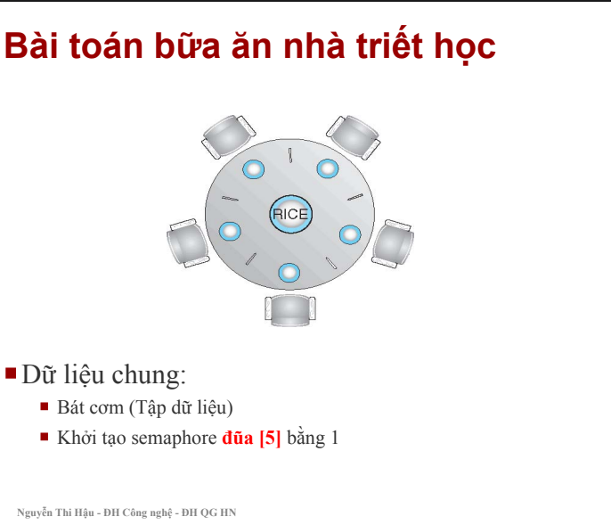

# philosopher_dining
# Bài tập tuần 5 
Lập trình bài toán bữa ăn của các nhà triết học với phương pháp sử dụng semaphore như trong slide NLHĐH-Bài 4. Mỗi nhà triết học là một tiến trình. Năm tiến trình nhà triết học chạy song song liên tục lấy đũa trái, phải, ăn nếu đủ cả hai đũa (trong 5 ms), sau khi ăn nhả cả 2 đũa (nghĩ).

Sinh viên có thể sử dụng bất cứ ngôn ngữ lập trình nào (khuyến cáo nên dùng thread trong Java). Hiển thị trạng thái của 5 nhà triết học mỗi 5 ms (chỉ rõ đang có đũa nào).

